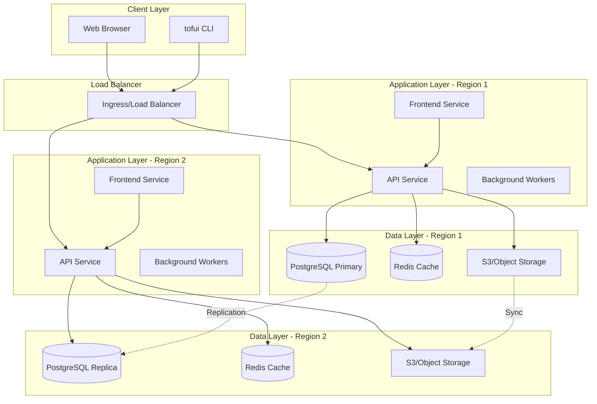
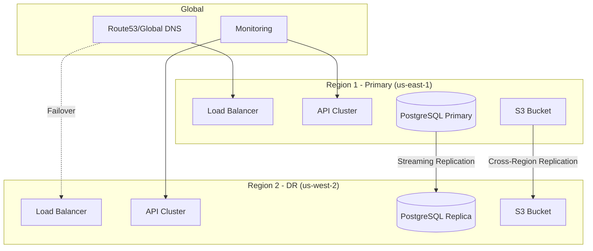

# tofUI Modernization Architecture

## Executive Summary

This document outlines the architectural design for modernizing tofUI from a static GitHub Pages dashboard to a production-grade Kubernetes application with database persistence and multi-region disaster recovery capabilities.

## Current Architecture Analysis

### Current State (GitHub Pages)

**Components:**
- Static HTML/CSS/JavaScript dashboard ([`index.html`](static-dashboard/index.html))
- JSON file-based storage in `reports/` directory
- Jekyll for cache-busting and site generation
- GitHub Pages for hosting
- Python CLI tool ([`publisher.py`](tofui/publisher.py)) for report publishing

**Data Flow:**
```
CI/CD Pipeline → tofui CLI → GitHub API → gh-pages branch → GitHub Pages → Users
```

**Limitations:**
1. **No Database**: All data stored as individual JSON files
2. **No API**: Direct file access only, no programmatic queries
3. **Limited Scalability**: GitHub Pages has rate limits and file size constraints
4. **No Real-time Updates**: Requires Jekyll rebuild (30-60 seconds)
5. **No Authentication**: Public access only
6. **No Analytics**: Limited insight into usage patterns
7. **Single Region**: No DR or multi-region support
8. **Cache Issues**: Complex cache-busting required

### Current Data Model

**Report JSON Structure:**
```json
{
  "source_repo": "owner/repo",
  "folder": "aws_us_east_2",
  "report_type": "build",
  "build_name": "deploy-123",
  "display_name": "Production Deploy 123",
  "html_url": "https://pages.../report.html",
  "statuses": {
    "terraform_plan": 2,
    "terraform_apply": 0,
    "tfsec": 0,
    "tflint": 0
  },
  "timestamp": "2024-01-15T10:30:00Z",
  "slot_number": 1
}
```

**Configuration Structure:**
```json
{
  "status_types": {
    "terraform_plan": {
      "name": "Terraform Plan",
      "mappings": {
        "0": {"label": "No Changes", "emoji": "🅿️", "color": "#0969da", "status": "passing"}
      }
    }
  },
  "repositories": {
    "owner/repo": {
      "display_name": "Infrastructure",
      "folders": ["aws_us_east_1", "aws_us_east_2"]
    }
  }
}
```

---

## Proposed Modern Architecture

### High-Level Architecture



### Component Architecture

#### 1. Frontend Service

**Technology:** React/Next.js or Vue.js
**Purpose:** Modern, responsive dashboard UI

**Features:**
- Server-side rendering for performance
- Real-time updates via WebSockets
- Advanced filtering and search
- User authentication UI
- Responsive design for mobile
- Dark mode support

**Endpoints:**
- `/` - Dashboard home
- `/repos/:owner/:repo` - Repository view
- `/repos/:owner/:repo/:folder` - Folder view
- `/reports/:id` - Individual report view
- `/settings` - Configuration management

#### 2. API Service

**Technology:** FastAPI (Python) or Go
**Purpose:** RESTful API for all data operations

**Core Endpoints:**

```
POST   /api/v1/reports              - Create new report
GET    /api/v1/reports              - List reports (with filters)
GET    /api/v1/reports/:id          - Get specific report
PUT    /api/v1/reports/:id          - Update report
DELETE /api/v1/reports/:id          - Delete report

GET    /api/v1/repositories         - List repositories
GET    /api/v1/repositories/:id     - Get repository details
POST   /api/v1/repositories         - Register repository

GET    /api/v1/folders              - List folders
GET    /api/v1/status-types         - Get status type configurations

GET    /api/v1/health               - Health check
GET    /api/v1/metrics              - Prometheus metrics
```

**Features:**
- JWT authentication
- Rate limiting
- Request validation
- API versioning
- OpenAPI/Swagger documentation
- Prometheus metrics
- Structured logging

#### 3. Background Workers

**Technology:** Celery (Python) or similar
**Purpose:** Asynchronous task processing

**Tasks:**
- Report HTML generation
- S3 upload/sync
- Database cleanup (old reports)
- Cache warming
- Analytics aggregation
- Cross-region replication verification

#### 4. Database Layer

**Technology:** PostgreSQL 15+
**Purpose:** Persistent storage for all application data

**Schema Design:**

```sql
-- Repositories table
CREATE TABLE repositories (
    id UUID PRIMARY KEY DEFAULT gen_random_uuid(),
    owner VARCHAR(255) NOT NULL,
    name VARCHAR(255) NOT NULL,
    display_name VARCHAR(255),
    created_at TIMESTAMP DEFAULT NOW(),
    updated_at TIMESTAMP DEFAULT NOW(),
    UNIQUE(owner, name)
);

-- Folders table
CREATE TABLE folders (
    id UUID PRIMARY KEY DEFAULT gen_random_uuid(),
    repository_id UUID REFERENCES repositories(id) ON DELETE CASCADE,
    name VARCHAR(255) NOT NULL,
    display_name VARCHAR(255),
    created_at TIMESTAMP DEFAULT NOW(),
    UNIQUE(repository_id, name)
);

-- Status types configuration
CREATE TABLE status_types (
    id UUID PRIMARY KEY DEFAULT gen_random_uuid(),
    type_key VARCHAR(50) UNIQUE NOT NULL,
    display_name VARCHAR(255) NOT NULL,
    config JSONB NOT NULL,
    created_at TIMESTAMP DEFAULT NOW(),
    updated_at TIMESTAMP DEFAULT NOW()
);

-- Reports table
CREATE TABLE reports (
    id UUID PRIMARY KEY DEFAULT gen_random_uuid(),
    repository_id UUID REFERENCES repositories(id) ON DELETE CASCADE,
    folder_id UUID REFERENCES folders(id) ON DELETE SET NULL,
    report_type VARCHAR(50) NOT NULL, -- 'test' or 'build'
    build_name VARCHAR(255) NOT NULL,
    display_name VARCHAR(255),
    html_url TEXT,
    html_content TEXT, -- Store HTML directly or S3 key
    statuses JSONB NOT NULL,
    metadata JSONB,
    created_at TIMESTAMP DEFAULT NOW(),
    updated_at TIMESTAMP DEFAULT NOW()
);

-- Indexes for performance
CREATE INDEX idx_reports_repo ON reports(repository_id);
CREATE INDEX idx_reports_folder ON reports(folder_id);
CREATE INDEX idx_reports_type ON reports(report_type);
CREATE INDEX idx_reports_created ON reports(created_at DESC);
CREATE INDEX idx_reports_statuses ON reports USING GIN(statuses);

-- Audit log table
CREATE TABLE audit_logs (
    id UUID PRIMARY KEY DEFAULT gen_random_uuid(),
    entity_type VARCHAR(50) NOT NULL,
    entity_id UUID NOT NULL,
    action VARCHAR(50) NOT NULL,
    user_id VARCHAR(255),
    changes JSONB,
    created_at TIMESTAMP DEFAULT NOW()
);

-- User sessions (if implementing auth)
CREATE TABLE user_sessions (
    id UUID PRIMARY KEY DEFAULT gen_random_uuid(),
    user_id VARCHAR(255) NOT NULL,
    token_hash VARCHAR(255) NOT NULL,
    expires_at TIMESTAMP NOT NULL,
    created_at TIMESTAMP DEFAULT NOW()
);
```

**Data Retention Policy:**
- Keep last 30 reports per folder/type combination
- Archive older reports to cold storage
- Automatic cleanup via background workers

#### 5. Cache Layer

**Technology:** Redis 7+
**Purpose:** High-performance caching and real-time features

**Use Cases:**
- API response caching (5-minute TTL)
- Session storage
- Rate limiting counters
- Real-time dashboard updates (pub/sub)
- Report generation queue

**Cache Keys:**
```
reports:list:{repo}:{folder}:{type}  - Report listings
reports:detail:{id}                   - Individual reports
repos:list                            - Repository list
status:types                          - Status type configs
```

#### 6. Object Storage (Pluggable Backend)

**Purpose:** Store HTML reports and assets with flexible, configurable storage backends

**Storage Abstraction Layer:**

The application uses a pluggable storage interface supporting multiple backends, allowing users to choose their preferred storage solution based on their infrastructure and requirements.

**Supported Storage Backends:**

1. **AWS S3** - Native AWS integration with cross-region replication
2. **Google Cloud Storage (GCS)** - Native GCP integration with multi-region buckets
3. **Azure Blob Storage** - Native Azure integration with geo-redundant storage
4. **MinIO** - Self-hosted S3-compatible storage for on-premise/multi-cloud
5. **Local/NFS Storage** - Kubernetes PersistentVolume for development/testing
6. **Database Storage** - Store HTML in PostgreSQL for small deployments

**Storage Interface:**

```python
# storage/interface.py
from abc import ABC, abstractmethod
from typing import BinaryIO

class StorageBackend(ABC):
    """Abstract storage interface for pluggable backends"""
    
    @abstractmethod
    async def upload(self, key: str, content: BinaryIO, content_type: str) -> str:
        """Upload file and return public URL"""
        pass
    
    @abstractmethod
    async def download(self, key: str) -> bytes:
        """Download file content"""
        pass
    
    @abstractmethod
    async def delete(self, key: str) -> bool:
        """Delete file"""
        pass
    
    @abstractmethod
    async def exists(self, key: str) -> bool:
        """Check if file exists"""
        pass
```

**Configuration Example:**

```yaml
# config/storage.yaml
storage:
  backend: "s3"  # Options: s3, gcs, azure, minio, local, database
  
  # AWS S3 Configuration
  s3:
    bucket: "tofui-reports"
    region: "us-east-1"
    access_key_id: "${AWS_ACCESS_KEY_ID}"
    secret_access_key: "${AWS_SECRET_ACCESS_KEY}"
    
  # Google Cloud Storage Configuration
  gcs:
    bucket: "tofui-reports"
    project_id: "my-project"
    credentials_file: "/secrets/gcs-key.json"
    
  # Azure Blob Storage Configuration
  azure:
    account_name: "tofuistorage"
    account_key: "${AZURE_STORAGE_KEY}"
    container: "tofui-reports"
    
  # MinIO Configuration (Self-hosted)
  minio:
    endpoint: "minio.tofui-prod.svc.cluster.local:9000"
    bucket: "tofui-reports"
    access_key: "${MINIO_ACCESS_KEY}"
    secret_key: "${MINIO_SECRET_KEY}"
    secure: true
    
  # Local Storage Configuration
  local:
    base_path: "/data/tofui-reports"
    pvc_name: "tofui-storage-pvc"
    
  # Database Storage Configuration
  database:
    enabled: true
    max_size_mb: 10  # Max file size to store in DB
```

**Storage Backend Comparison:**

| Backend | Pros | Cons | Best For | Cost |
|---------|------|------|----------|------|
| **AWS S3** | Highly scalable, reliable, cheap, cross-region replication | AWS lock-in | AWS deployments | $0.023/GB |
| **GCS** | GCP native, good performance, multi-region | GCP lock-in | GCP deployments | $0.020/GB |
| **Azure Blob** | Azure native, geo-redundant, tiered storage | Azure lock-in | Azure deployments | $0.018/GB |
| **MinIO** | Self-hosted, S3-compatible, no vendor lock-in, full control | Requires management | On-premise, multi-cloud | Infrastructure only |
| **Local/NFS** | Simple, fast for small scale, no external deps | Not scalable, SPOF | Development, testing | Infrastructure only |
| **Database** | No external deps, simple setup, transactional | Limited scale, expensive | Small deployments (<1000 reports) | Included in DB |

**MinIO Kubernetes Deployment (Self-Hosted Option):**

```yaml
# minio-statefulset.yaml
apiVersion: apps/v1
kind: StatefulSet
metadata:
  name: minio
  namespace: tofui-prod
spec:
  serviceName: minio
  replicas: 4  # Distributed mode for HA
  selector:
    matchLabels:
      app: minio
  template:
    metadata:
      labels:
        app: minio
    spec:
      containers:
      - name: minio
        image: minio/minio:latest
        args:
        - server
        - http://minio-{0...3}.minio.tofui-prod.svc.cluster.local/data
        - --console-address
        - ":9001"
        env:
        - name: MINIO_ROOT_USER
          valueFrom:
            secretKeyRef:
              name: minio-secret
              key: root-user
        - name: MINIO_ROOT_PASSWORD
          valueFrom:
            secretKeyRef:
              name: minio-secret
              key: root-password
        ports:
        - containerPort: 9000
          name: api
        - containerPort: 9001
          name: console
        volumeMounts:
        - name: data
          mountPath: /data
        resources:
          requests:
            memory: "512Mi"
            cpu: "500m"
          limits:
            memory: "2Gi"
            cpu: "1000m"
  volumeClaimTemplates:
  - metadata:
      name: data
    spec:
      accessModes: ["ReadWriteOnce"]
      resources:
        requests:
          storage: 100Gi
```

**Storage Path Structure (All Backends):**
```
tofui-reports/
├── reports/
│   ├── {repo-owner}/
│   │   ├── {repo-name}/
│   │   │   ├── {folder}/
│   │   │   │   ├── {report-id}.html
│   │   │   │   └── {report-id}.json
├── assets/
│   └── logos/
└── archives/
    └── {year}/
        └── {month}/
```

**Recommendation by Deployment:**

- **AWS Cloud:** Use S3 (native, cost-effective)
- **GCP Cloud:** Use GCS (native, performant)
- **Azure Cloud:** Use Azure Blob (native, integrated)
- **On-Premise:** Use MinIO (S3-compatible, self-hosted)
- **Multi-Cloud:** Use MinIO (portable across clouds)
- **Development:** Use Local or Database storage
- **Small Scale (<1000 reports):** Database storage sufficient

---

## Kubernetes Deployment Architecture

### Namespace Structure

```yaml
namespaces:
  - tofui-prod        # Production environment
  - tofui-staging     # Staging environment
  - tofui-monitoring  # Monitoring stack
```

### Deployment Components

#### 1. API Deployment

```yaml
apiVersion: apps/v1
kind: Deployment
metadata:
  name: tofui-api
  namespace: tofui-prod
spec:
  replicas: 3
  strategy:
    type: RollingUpdate
    rollingUpdate:
      maxSurge: 1
      maxUnavailable: 0
  selector:
    matchLabels:
      app: tofui-api
  template:
    metadata:
      labels:
        app: tofui-api
        version: v1
    spec:
      containers:
      - name: api
        image: tofui/api:latest
        ports:
        - containerPort: 8000
        env:
        - name: DATABASE_URL
          valueFrom:
            secretKeyRef:
              name: tofui-secrets
              key: database-url
        - name: REDIS_URL
          valueFrom:
            secretKeyRef:
              name: tofui-secrets
              key: redis-url
        resources:
          requests:
            memory: "256Mi"
            cpu: "250m"
          limits:
            memory: "512Mi"
            cpu: "500m"
        livenessProbe:
          httpGet:
            path: /api/v1/health
            port: 8000
          initialDelaySeconds: 30
          periodSeconds: 10
        readinessProbe:
          httpGet:
            path: /api/v1/health
            port: 8000
          initialDelaySeconds: 5
          periodSeconds: 5
```

#### 2. Frontend Deployment

```yaml
apiVersion: apps/v1
kind: Deployment
metadata:
  name: tofui-frontend
  namespace: tofui-prod
spec:
  replicas: 2
  selector:
    matchLabels:
      app: tofui-frontend
  template:
    metadata:
      labels:
        app: tofui-frontend
    spec:
      containers:
      - name: frontend
        image: tofui/frontend:latest
        ports:
        - containerPort: 3000
        env:
        - name: API_URL
          value: "http://tofui-api:8000"
        resources:
          requests:
            memory: "128Mi"
            cpu: "100m"
          limits:
            memory: "256Mi"
            cpu: "200m"
```

#### 3. Worker Deployment

```yaml
apiVersion: apps/v1
kind: Deployment
metadata:
  name: tofui-worker
  namespace: tofui-prod
spec:
  replicas: 2
  selector:
    matchLabels:
      app: tofui-worker
  template:
    metadata:
      labels:
        app: tofui-worker
    spec:
      containers:
      - name: worker
        image: tofui/worker:latest
        env:
        - name: DATABASE_URL
          valueFrom:
            secretKeyRef:
              name: tofui-secrets
              key: database-url
        - name: REDIS_URL
          valueFrom:
            secretKeyRef:
              name: tofui-secrets
              key: redis-url
        resources:
          requests:
            memory: "256Mi"
            cpu: "250m"
          limits:
            memory: "512Mi"
            cpu: "500m"
```

#### 4. PostgreSQL StatefulSet

```yaml
apiVersion: apps/v1
kind: StatefulSet
metadata:
  name: tofui-postgres
  namespace: tofui-prod
spec:
  serviceName: tofui-postgres
  replicas: 1
  selector:
    matchLabels:
      app: tofui-postgres
  template:
    metadata:
      labels:
        app: tofui-postgres
    spec:
      containers:
      - name: postgres
        image: postgres:15-alpine
        ports:
        - containerPort: 5432
        env:
        - name: POSTGRES_DB
          value: tofui
        - name: POSTGRES_USER
          valueFrom:
            secretKeyRef:
              name: tofui-secrets
              key: postgres-user
        - name: POSTGRES_PASSWORD
          valueFrom:
            secretKeyRef:
              name: tofui-secrets
              key: postgres-password
        volumeMounts:
        - name: postgres-storage
          mountPath: /var/lib/postgresql/data
        resources:
          requests:
            memory: "512Mi"
            cpu: "500m"
          limits:
            memory: "1Gi"
            cpu: "1000m"
  volumeClaimTemplates:
  - metadata:
      name: postgres-storage
    spec:
      accessModes: ["ReadWriteOnce"]
      resources:
        requests:
          storage: 20Gi
```

#### 5. Redis Deployment

```yaml
apiVersion: apps/v1
kind: Deployment
metadata:
  name: tofui-redis
  namespace: tofui-prod
spec:
  replicas: 1
  selector:
    matchLabels:
      app: tofui-redis
  template:
    metadata:
      labels:
        app: tofui-redis
    spec:
      containers:
      - name: redis
        image: redis:7-alpine
        ports:
        - containerPort: 6379
        resources:
          requests:
            memory: "128Mi"
            cpu: "100m"
          limits:
            memory: "256Mi"
            cpu: "200m"
```

#### 6. Ingress Configuration

```yaml
apiVersion: networking.k8s.io/v1
kind: Ingress
metadata:
  name: tofui-ingress
  namespace: tofui-prod
  annotations:
    cert-manager.io/cluster-issuer: letsencrypt-prod
    nginx.ingress.kubernetes.io/ssl-redirect: "true"
    nginx.ingress.kubernetes.io/rate-limit: "100"
spec:
  ingressClassName: nginx
  tls:
  - hosts:
    - tofui.example.com
    secretName: tofui-tls
  rules:
  - host: tofui.example.com
    http:
      paths:
      - path: /api
        pathType: Prefix
        backend:
          service:
            name: tofui-api
            port:
              number: 8000
      - path: /
        pathType: Prefix
        backend:
          service:
            name: tofui-frontend
            port:
              number: 3000
```

---

## Multi-Region DR Strategy

### Architecture Overview



### Replication Strategy

#### 1. Database Replication

**PostgreSQL Streaming Replication:**
- Primary in Region 1 (us-east-1)
- Standby replica in Region 2 (us-west-2)
- Asynchronous replication for performance
- Automatic failover with Patroni

**Configuration:**
```yaml
# Primary (Region 1)
postgresql.conf:
  wal_level: replica
  max_wal_senders: 10
  wal_keep_size: 1GB
  hot_standby: on

# Replica (Region 2)
recovery.conf:
  standby_mode: on
  primary_conninfo: 'host=primary-db port=5432 user=replicator'
  trigger_file: '/tmp/postgresql.trigger'
```

**RPO (Recovery Point Objective):** < 5 minutes
**RTO (Recovery Time Objective):** < 15 minutes

#### 2. Object Storage Replication

**S3 Cross-Region Replication:**
```json
{
  "Role": "arn:aws:iam::account:role/s3-replication",
  "Rules": [{
    "Status": "Enabled",
    "Priority": 1,
    "Filter": {"Prefix": ""},
    "Destination": {
      "Bucket": "arn:aws:s3:::tofui-reports-us-west-2",
      "ReplicationTime": {
        "Status": "Enabled",
        "Time": {"Minutes": 15}
      }
    }
  }]
}
```

#### 3. Application State Sync

**Redis Replication:**
- Redis Sentinel for automatic failover
- Master-replica setup across regions
- Asynchronous replication

**Session Handling:**
- JWT tokens (stateless)
- Session data in database (replicated)
- No sticky sessions required

### Failover Procedures

#### Automatic Failover

**Health Checks:**
```yaml
healthcheck:
  primary:
    - endpoint: /api/v1/health
    - database: SELECT 1
    - redis: PING
  interval: 10s
  timeout: 5s
  unhealthy_threshold: 3
```

**DNS Failover:**
- Route53 health checks on primary
- Automatic DNS update on failure
- TTL: 60 seconds for fast propagation

#### Manual Failover

**Procedure:**
1. Verify secondary region health
2. Promote PostgreSQL replica to primary
3. Update DNS to point to Region 2
4. Redirect traffic via load balancer
5. Monitor application metrics

**Rollback:**
1. Verify primary region recovery
2. Re-establish replication
3. Update DNS back to Region 1
4. Monitor for data consistency

---

## Technology Stack

### Backend

**Primary Language:** Python 3.11+
- **Framework:** FastAPI
- **ORM:** SQLAlchemy 2.0
- **Migrations:** Alembic
- **Task Queue:** Celery with Redis
- **Validation:** Pydantic v2

**Alternative:** Go
- **Framework:** Gin or Echo
- **ORM:** GORM
- **Better performance for high-throughput scenarios

### Frontend

**Framework:** React 18+ with Next.js 14
- **State Management:** Zustand or Redux Toolkit
- **UI Library:** shadcn/ui or Material-UI
- **Charts:** Recharts or Chart.js
- **Real-time:** Socket.io client

**Alternative:** Vue 3 with Nuxt 3
- **State Management:** Pinia
- **UI Library:** Vuetify or PrimeVue

### Database

**Primary:** PostgreSQL 15+
- **Extensions:** pg_trgm (text search), pgcrypto (encryption)
- **Connection Pooling:** PgBouncer
- **Backup:** pg_basebackup + WAL archiving

### Cache

**Primary:** Redis 7+
- **Clustering:** Redis Sentinel
- **Persistence:** RDB + AOF
- **Use Cases:** Cache, sessions, pub/sub, queues

### Object Storage

**Cloud:** AWS S3 or Azure Blob Storage
**On-Premise:** MinIO
- **Versioning:** Enabled
- **Lifecycle:** Transition to Glacier after 90 days
- **Encryption:** Server-side (SSE-S3)

### Container Orchestration

**Kubernetes:** 1.28+
- **Distribution:** EKS, AKS, or GKE
- **Service Mesh:** Istio (optional)
- **Ingress:** NGINX Ingress Controller
- **Cert Manager:** Let's Encrypt integration

### Monitoring & Observability

**Metrics:** Prometheus + Grafana
**Logging:** ELK Stack or Loki
**Tracing:** Jaeger or Tempo
**Alerting:** AlertManager
**APM:** Datadog or New Relic (optional)

### CI/CD

**Pipeline:** GitHub Actions or GitLab CI
**Container Registry:** Docker Hub, ECR, or Harbor
**GitOps:** ArgoCD or Flux
**Security Scanning:** Trivy, Snyk

---

## Implementation Roadmap

### Phase 1: Foundation (Weeks 1-4)

**Goals:**
- Set up development environment
- Create database schema
- Build basic API endpoints
- Implement authentication

**Deliverables:**
- [ ] PostgreSQL database with schema
- [ ] FastAPI application skeleton
- [ ] Basic CRUD endpoints for reports
- [ ] JWT authentication
- [ ] Docker containers for all services
- [ ] Local development with docker-compose

**Success Criteria:**
- API can create and retrieve reports
- Database migrations working
- Authentication functional
- All services running in containers

### Phase 2: Core Features (Weeks 5-8)

**Goals:**
- Build frontend dashboard
- Implement report publishing
- Add background workers
- Set up Redis caching

**Deliverables:**
- [ ] React dashboard with report listing
- [ ] Report detail view
- [ ] Repository and folder management
- [ ] Background worker for HTML generation
- [ ] Redis caching layer
- [ ] S3 integration for HTML storage

**Success Criteria:**
- Dashboard displays reports from database
- New reports can be published via API
- HTML reports stored in S3
- Cache improves response times

### Phase 3: Kubernetes Deployment (Weeks 9-12)

**Goals:**
- Deploy to Kubernetes
- Set up monitoring
- Implement CI/CD
- Configure ingress and TLS

**Deliverables:**
- [ ] Kubernetes manifests for all services
- [ ] Helm charts (optional)
- [ ] Prometheus + Grafana monitoring
- [ ] GitHub Actions CI/CD pipeline
- [ ] NGINX Ingress with TLS
- [ ] Staging environment

**Success Criteria:**
- Application running in Kubernetes
- Automated deployments working
- Monitoring dashboards operational
- HTTPS access configured

### Phase 4: Multi-Region DR (Weeks 13-16)

**Goals:**
- Set up secondary region
- Configure replication
- Implement failover
- Test DR procedures

**Deliverables:**
- [ ] PostgreSQL streaming replication
- [ ] S3 cross-region replication
- [ ] DNS failover configuration
- [ ] Automated health checks
- [ ] DR runbook and procedures
- [ ] Failover testing results

**Success Criteria:**
- Secondary region fully operational
- Replication lag < 5 minutes
- Successful failover test
- RTO < 15 minutes achieved

### Phase 5: Migration & Optimization (Weeks 17-20)

**Goals:**
- Migrate data from GitHub Pages
- Optimize performance
- Add advanced features
- Production hardening

**Deliverables:**
- [ ] Data migration scripts
- [ ] Performance optimization
- [ ] Advanced search and filtering
- [ ] Real-time updates via WebSockets
- [ ] API rate limiting
- [ ] Security hardening

**Success Criteria:**
- All historical data migrated
- API response time < 200ms (p95)
- Dashboard load time < 2s
- Security audit passed

---

## Migration Strategy

### Data Migration

#### Step 1: Export from GitHub Pages

```python
# migration/export_github_pages.py
import json
import requests
from pathlib import Path

def export_reports(repo, branch='gh-pages'):
    """Export all reports from GitHub Pages"""
    api_url = f"https://api.github.com/repos/{repo}/contents/reports"
    response = requests.get(f"{api_url}?ref={branch}")
    
    reports = []
    for file in response.json():
        if file['name'].endswith('.json'):
            content = requests.get(file['download_url']).json()
            reports.append(content)
    
    return reports

# Export to local file
reports = export_reports('owner/tofui-dashboard')
Path('migration/reports.json').write_text(json.dumps(reports, indent=2))
```

#### Step 2: Import to Database

```python
# migration/import_to_database.py
import json
from sqlalchemy import create_engine
from models import Repository, Folder, Report

def import_reports(reports_file):
    """Import reports into PostgreSQL"""
    engine = create_engine(DATABASE_URL)
    
    with open(reports_file) as f:
        reports = json.load(f)
    
    for report_data in reports:
        # Create or get repository
        repo = get_or_create_repository(
            owner=report_data['source_repo'].split('/')[0],
            name=report_data['source_repo'].split('/')[1]
        )
        
        # Create or get folder
        folder = get_or_create_folder(
            repository=repo,
            name=report_data['folder']
        )
        
        # Create report
        report = Report(
            repository=repo,
            folder=folder,
            report_type=report_data['report_type'],
            build_name=report_data['build_name'],
            display_name=report_data.get('display_name'),
            html_url=report_data.get('html_url'),
            statuses=report_data['statuses'],
            created_at=report_data['timestamp']
        )
        
        session.add(report)
    
    session.commit()
```

#### Step 3: Migrate HTML Reports to S3

```python
# migration/migrate_html_to_s3.py
import boto3
import requests

def migrate_html_reports(reports):
    """Download HTML reports and upload to S3"""
    s3 = boto3.client('s3')
    
    for report in reports:
        if report['html_url']:
            # Download HTML
            html_content = requests.get(report['html_url']).text
            
            # Upload to S3
            s3_key = f"reports/{report['source_repo']}/{report['folder']}/{report['id']}.html"
            s3.put_object(
                Bucket='tofui-reports',
                Key=s3_key,
                Body=html_content,
                ContentType='text/html'
            )
```

### Gradual Rollout

**Phase 1: Parallel Running**
- Keep GitHub Pages active
- Deploy new system alongside
- Publish to both systems
- Compare results

**Phase 2: Soft Launch**
- Internal users access new system
- Monitor performance and bugs
- Gather feedback
- Fix issues

**Phase 3: Public Beta**
- Announce new system to users
- Provide both URLs
- Encourage migration
- Monitor adoption

**Phase 4: Full Migration**
- Make new system primary
- Redirect GitHub Pages to new URL
- Archive old system
- Celebrate! 🎉

### Rollback Plan

**If issues arise:**
1. DNS switch back to GitHub Pages
2. Investigate and fix issues
3. Re-test in staging
4. Retry migration

**Data Consistency:**
- Keep GitHub Pages updated during transition
- Maintain dual-write capability
- Verify data integrity regularly

---

## Cost Estimation

### Infrastructure Costs (Monthly)

**Kubernetes Cluster:**
- 3 nodes (t3.medium): $75
- Load balancer: $20
- Total: ~$95/month

**Database:**
- RDS PostgreSQL (db.t3.medium): $60
- Storage (100GB): $10
- Backups: $5
- Total: ~$75/month

**Object Storage:**
- S3 storage (100GB): $2.30
- Requests: $5
- Data transfer: $10
- Total: ~$17/month

**Cache:**
- ElastiCache Redis (cache.t3.micro): $15/month

**Monitoring:**
- CloudWatch/Prometheus: $20/month

**Total Primary Region:** ~$222/month

**DR Region (Standby):**
- Reduced capacity: ~$150/month

**Grand Total:** ~$372/month

**Comparison to GitHub Pages:**
- GitHub Pages: Free (with limitations)
- New system: $372/month
- **Value Add:** Database, API, DR, scalability, no cache issues

---

## Security Considerations

### Authentication & Authorization

**JWT Tokens:**
- Short-lived access tokens (15 minutes)
- Refresh tokens (7 days)
- Secure token storage

**API Keys:**
- For CLI tool integration
- Scoped permissions
- Rotation policy

**RBAC (Role-Based Access Control):**
- Admin: Full access
- Developer: Read/write reports
- Viewer: Read-only access

### Network Security

**Kubernetes Network Policies:**
```yaml
apiVersion: networking.k8s.io/v1
kind: NetworkPolicy
metadata:
  name: tofui-api-policy
spec:
  podSelector:
    matchLabels:
      app: tofui-api
  policyTypes:
  - Ingress
  - Egress
  ingress:
  - from:
    - podSelector:
        matchLabels:
          app: tofui-frontend
    ports:
    - protocol: TCP
      port: 8000
```

**TLS Everywhere:**
- HTTPS for all external traffic
- TLS for database connections
- Encrypted S3 storage

### Data Protection

**Encryption:**
- At rest: Database encryption, S3 SSE
- In transit: TLS 1.3
- Secrets: Kubernetes Secrets or Vault

**Backup:**
- Daily database backups
- 30-day retention
- Encrypted backups in S3

**Compliance:**
- GDPR considerations
- Data retention policies
- Audit logging

---

## Performance Targets

### API Performance

- **Response Time:** < 200ms (p95)
- **Throughput:** 1000 req/s
- **Availability:** 99.9% uptime

### Database Performance

- **Query Time:** < 50ms (p95)
- **Connection Pool:** 20-50 connections
- **Replication Lag:** < 5 seconds

### Frontend Performance

- **Initial Load:** < 2 seconds
- **Time to Interactive:** < 3 seconds
- **Lighthouse Score:** > 90

### Caching Strategy

- **API Responses:** 5-minute TTL
- **Static Assets:** 1-day TTL
- **CDN:** CloudFront or similar

---

## Monitoring & Alerting

### Key Metrics

**Application Metrics:**
- Request rate
- Error rate
- Response time (p50, p95, p99)
- Active users

**Infrastructure Metrics:**
- CPU usage
- Memory usage
- Disk I/O
- Network traffic

**Business Metrics:**
- Reports published per day
- Active repositories
- User engagement

### Alerts

**Critical:**
- API down (> 5 minutes)
- Database unreachable
- Replication lag > 10 minutes

**Warning:**
- High error rate (> 5%)
- Slow response time (> 500ms)
- High memory usage (> 80%)

### Dashboards

**Operations Dashboard:**
- System health overview
- Resource utilization
- Error rates

**Business Dashboard:**
- Report statistics
- User activity
- Growth metrics

---

## Next Steps

1. **Review this architecture** with your team
2. **Prioritize features** based on business needs
3. **Set up development environment** for Phase 1
4. **Create project repository** with initial structure
5. **Begin implementation** following the roadmap

## Questions to Consider

1. **Cloud Provider:** AWS, Azure, GCP, or on-premise?
2. **Authentication:** Internal SSO integration needed?
3. **Compliance:** Any specific regulatory requirements?
4. **Budget:** Is $372/month acceptable?
5. **Timeline:** Is 20 weeks realistic for your team?
6. **Team Size:** How many developers available?
7. **Existing Infrastructure:** Can we leverage existing K8s clusters?

---

## Conclusion

This architecture provides a solid foundation for modernizing tofUI into a production-grade application with:

✅ **Scalability** - Kubernetes-based deployment
✅ **Reliability** - Multi-region DR with < 15 min RTO
✅ **Performance** - Database + caching for fast queries
✅ **Maintainability** - Modern tech stack with good tooling
✅ **Security** - Authentication, encryption, network policies
✅ **Observability** - Comprehensive monitoring and logging

The phased approach allows for incremental delivery while maintaining the existing GitHub Pages system during transition.

---

*Document Version: 1.0*
*Last Updated: 2024-01-15*
*Author: Bob (Architect Mode)*